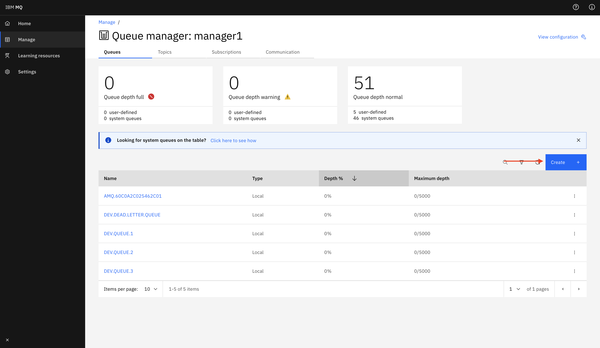
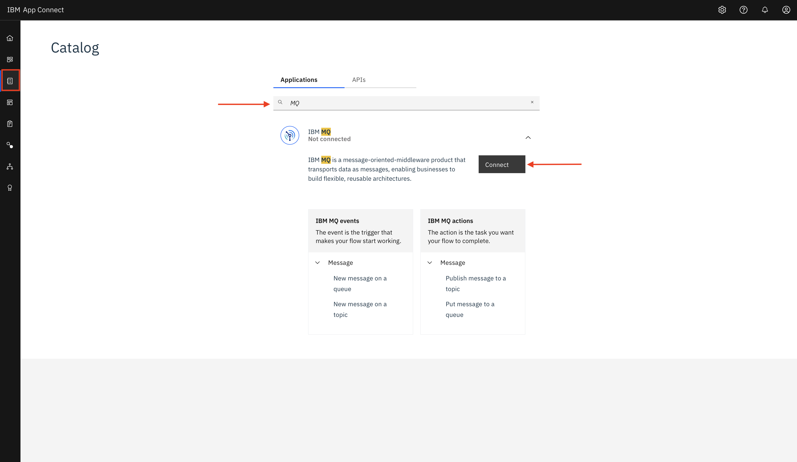

# Use IBM MQ and App Connect on Cloud to transform data

In this code pattern, we will learn how to use IBM MQ along with App Connect and transform data to communicate with a Legacy Application.

When you have completed this code pattern, you will understand how to:

* Use IBM MQ to create queues and push messages to them.
* Use App Connect on cloud to create seamless integrations between applications and services.

<!--add an image in this path-->


<!--Optionally, add flow steps based on the architecture diagram-->
## Flow

1. App A sends a message to MQ using Rest API.

2. App Connect Flow picks up message from Queue and converts JSON request into XML Request and puts to another queue for App C to consume.

3. App C fetches the message from request queue, parses it and sends a XML Response to Response Queue

4. App Connect Flow picks response from Queue and transforms XML to JSON and puts to another queue for App A to consume.

5. App A fetches response from queue and displays data.

<!--Optionally, update this section when the video is created-->
## Watch the Video

[]()

## Pre-requisites

1. [IBM Cloud](https://cloud.ibm.com) Account

2. [Node JS](https://nodejs.org/en/)

## Steps

1. [Clone the repo](#1-clone-the-repo)

2. [Create Services](#2-Create-services)

3. [Deploy the Application](#3-deploy-the-application)

4. [Run the Application](#4-run-the-application)

### 1. Clone the repo

Clone the [`Use-IBM-MQ-and-App-Connect-on-Cloud-to-transform-data`](https://github.com/IBM/Use-IBM-MQ-and-App-Connect-on-Cloud-to-transform-data) repo locally. In a terminal, run:

```bash
git clone https://github.com/IBM/Use-IBM-MQ-and-App-Connect-on-Cloud-to-transform-data.git
```

### 2. Create Services

#### 2.1 Create and Configure IBM MQ on Cloud

* Create a free IBM MQ service [here](https://cloud.ibm.com/catalog/services/mq).


* Create new User Credentials by selecting `User credentials` and clicking `Add`.


* Enter your IBM Cloud Email and hit `Add Credentials`.


* Create new Application Credentials by selecting `Application credentials` and clicking `Add`.


* Enter a name for the credentials and hit `Add and generate Key`.


* Upon successful creation you will see a prompt as shown in the picture. Download your credentials and store them as you will not be able to see them later on the console.


#### 2.2 Create New Queue Manager

* Now create a new queue manager by selecting `Queue Managers` from the nav bar and hit `Create`.

* Enter the queue manager name and click `Create`.


>Note: Queue Manager will take about 10 minutes to initialize. Till then you can continue the next steps from [here](#2.2-IBM-App-Connect-on-Cloud) and continue these steps later.

* After Queue Manager is deployed, click it to see the Manager console. Copy the credentials and make a note of it as we will need it later.


* After this click `Administration` and click `Launch MQ Console`


* Once Inside MQ Console, Navigate to Manage > Communication > App Channels and click the three dots next to `CLOUD.APP.SVRCONN` and select `View Configuration`


* Press `Edit` and scroll down to `SSL`, and enter `TLS_RSA_WITH_AES_128_CBC_SHA256` as the `SSL cipher spec` and press `Save`.


#### 2.3 Create New Queue

For this Code Pattern we need 4 queues. By default they are named `inputA, outputA, inputC, outputC`. You can set the queue names as per your choice but you'll have to set the environment accordingly.

* In the MQ Console, Create a new Queue by navigating to `Manage` and pressing `Create`.


* Select Local.


* Input name and press `Create`.


* Click 3 dots at the side of newly created queue and select `View Configuration`.


* Navigate to Security and click `Add`.


* Select Group from first dropdown and enter the name for the application credentials in the text box and check all the permissions and press `Add`.


* Now Repeat [step 2.3](#2.3-Create-New-Queue) and create remaining Queues.

#### 2.4 IBM App Connect on Cloud

* Create a free IBM App Connect on Cloud service [here](https://cloud.ibm.com/catalog/services/app-connect).


* From your newly created App Connect Service Dashboard, navigate to console by clicking `Launch App Connect`.


* After entering App Connect Console select `catalog` from side navigation bar, search `MQ` and click `Connect`.


* Enter your credentials as shown.


* Go back to Console Home and Click on `Import a Flow`.


* Select the file `A to C.yaml` from [here]('./App Connect Flows/A to C.yaml') and hit `import`.


* Click `Start Flow` from the dropdown by selecting three dots as shown in the picture.


>Note : If you have given custom names for queues, you will need to update them in the imported flows.

* Repeat the previous steps and import `C to A.yaml` from [here]('./App Connect Flows/C to A.yaml') and hit `import`.

### 3. Configure the Application

* Navigate to directory `node-app` and run the following command to install dependencies.

```bash
npm install
```

* Navigate to directory `web-app-c` and run the following command to install dependencies.

```bash
npm install
```

* Open `.env` file in `Use-IBM-MQ-and-App-Connect-on-Cloud-to-transform-data` directory and update with your credentials.


### 4. Run the Application

* Navigate to `node-web-app` directory and run the following command.

```bash
node server.js
```

>Note : A node server has now started on PORT:8080.

* In another Terminal navigate to `web-app-c` directory and run the following command.

```bash
node server.js
```

* Now visit `localhost:8080` to access the application.


* Enter `1` as container number and wait for response.


* After 5-10 seconds Press `Fetch` to display response.


### Summary

We used IBM MQ and App Connect to connect a modernized application with a legacy application and trsansfer data.

<!-- keep this -->
## License

This code pattern is licensed under the Apache License, Version 2. Separate third-party code objects invoked within this code pattern are licensed by their respective providers pursuant to their own separate licenses. Contributions are subject to the [Developer Certificate of Origin, Version 1.1](https://developercertificate.org/) and the [Apache License, Version 2](https://www.apache.org/licenses/LICENSE-2.0.txt).

[Apache License FAQ](https://www.apache.org/foundation/license-faq.html#WhatDoesItMEAN)
